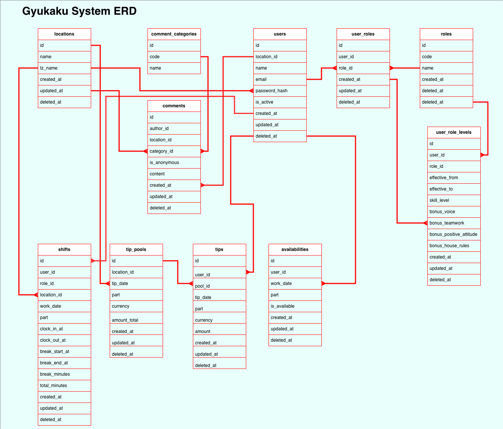

# Gyukaku System Database Design

## List of Tables

- locations
- users
- roles
- user_roles
- user_role_levels
- availabilities
- shifts
- tip_pools
- tips
- comment_categories
- comments

## Table Description

### 1. locations (restaurant information)

| **column name** | **type**    | **restriction**                       | **etc**           |
| --------------- | ----------- | ------------------------------------- | ----------------- |
| id              | BIGSERIAL   | PK                                    | NA                |
| name            | VARCHAR     | NOT NULL                              | branch name       |
| tz_name         | VARCHAR     | NOT NULL, DEFAULT 'America/Vancouver' | timezone          |
| created_at      | TIMESTAMPTZ | NOT NULL                              |                   |
| updated_at      | TIMESTAMPTZ | NOT NULL                              |                   |
| deleted_at      | TIMESTAMPTZ | NULL                                  | for soft deletion |

### 2. users

| **column name** | **type**    | **restriction**        | **etc**     |
| --------------- | ----------- | ---------------------- | ----------- |
| id              | BIGSERIAL   | PK                     |             |
| location_id     | BIGINT      | FK → locations.id      |             |
| name            | VARCHAR     | NOT NULL               | name        |
| email           | VARCHAR     | NULL                   | or login_id |
| password_hash   | VARCHAR     | NOT NULL               |             |
| is_active       | BOOLEAN     | NOT NULL, DEFAULT true |             |
| created_at      | TIMESTAMPTZ | NOT NULL               |             |
| updated_at      | TIMESTAMPTZ | NOT NULL               |             |
| deleted_at      | TIMESTAMPTZ | NULL                   |             |

### 3. roles (role type)

| **column name** | **type**    | **restriction**  | **etc**                                     |
| --------------- | ----------- | ---------------- | ------------------------------------------- |
| id              | BIGSERIAL   | PK               |                                             |
| code            | VARCHAR     | NOT NULL, UNIQUE | role code (mg, spv, sv, ktc, dw, hst, etc.) |
| name            | VARCHAR     | NOT NULL         | name for display                            |
| created_at      | TIMESTAMPTZ | NOT NULL         |                                             |
| updated_at      | TIMESTAMPTZ | NOT NULL         |                                             |
| deleted_at      | TIMESTAMPTZ | NULL             |                                             |

### 4. user_roles

| **column name** | **type**    | **restriction** | **etc** |
| --------------- | ----------- | --------------- | ------- |
| id              | BIGSERIAL   | PK              |         |
| user_id         | BIGINT      | FK → users.id   |         |
| role_id         | BIGINT      | FK → roles.id   |         |
| created_at      | TIMESTAMPTZ | NOT NULL        |         |
| updated_at      | TIMESTAMPTZ | NOT NULL        |         |
| deleted_at      | TIMESTAMPTZ | NULL            |         |

### 5. user_role_levels

| **column name**         | **type**    | **restriction**     | **etc**                      |
| ----------------------- | ----------- | ------------------- | ---------------------------- |
| id                      | BIGSERIAL   | PK                  |                              |
| user_id                 | BIGINT      | FK → users.id       |                              |
| role_id                 | BIGINT      | FK → roles.id       |                              |
| effective_from          | DATE        | NOT NULL            | current level effective from |
| effective_to            | DATE        | NULL                | NULL = currentily effective  |
| skill_level             | INTEGER     | NOT NULL, DEFAULT 0 |                              |
| bonus_voice             | INTEGER     | NOT NULL, DEFAULT 0 |                              |
| bonus_teamwork          | INTEGER     | NOT NULL, DEFAULT 0 |                              |
| bonus_positive_attitude | INTEGER     | NOT NULL, DEFAULT 0 |                              |
| bonus_house_rules       | INTEGER     | NOT NULL, DEFAULT 0 |                              |
| created_at              | TIMESTAMPTZ | NOT NULL            |                              |
| updated_at              | TIMESTAMPTZ | NOT NULL            |                              |
| deleted_at              | TIMESTAMPTZ | NULL                |                              |

### 6. availabilities

| **column name** | **type**    | **restriction** | **etc**           |
| --------------- | ----------- | --------------- | ----------------- |
| id              | BIGSERIAL   | PK              |                   |
| user_id         | BIGINT      | FK → users.id   |                   |
| work_date       | DATE        | NOT NULL        |                   |
| part            | VARCHAR(2)  | NOT NULL        | ENUM `AM` or `PM` |
| is_available    | BOOLEAN     | NULL            |                   |
| created_at      | TIMESTAMPTZ | NOT NULL        |                   |
| updated_at      | TIMESTAMPTZ | NOT NULL        |                   |
| deleted_at      | TIMESTAMPTZ | NULL            |                   |

### 7. shifts (actual working hours)

| **column name** | **type**    | **restriction**   | **etc**           |
| --------------- | ----------- | ----------------- | ----------------- |
| id              | BIGSERIAL   | PK                |                   |
| user_id         | BIGINT      | FK → users.id     |                   |
| role_id         | BIGINT      | FK → roles.id     |                   |
| location_id     | BIGINT      | FK → locations.id |                   |
| work_date       | DATE        | NOT NULL          |                   |
| part            | VARCHAR(2)  | NOT NULL          | ENUM `AM` or `PM` |
| clock_in_at     | TIMESTAMPTZ | NOT NULL          |                   |
| clock_out_at    | TIMESTAMPTZ | NOT NULL          |                   |
| break_start_at  | TIMESTAMPTZ | NULL              |                   |
| break_end_at    | TIMESTAMPTZ | NULL              |                   |
| break_minutes   | INTEGER     | NULL              |                   |
| total_minutes   | INTEGER     | NOT NULL          | 15 mins rounding? |
| created_at      | TIMESTAMPTZ | NOT NULL          |                   |
| updated_at      | TIMESTAMPTZ | NOT NULL          |                   |
| deleted_at      | TIMESTAMPTZ | NULL              |                   |

### 8. tip_pools (total tips)

| **column name** | **type**      | **restriction**         | **etc**           |
| --------------- | ------------- | ----------------------- | ----------------- |
| id              | BIGSERIAL     | PK                      |                   |
| location_id     | BIGINT        | FK → locations.id       |                   |
| tip_date        | DATE          | NOT NULL                |                   |
| part            | VARCHAR(2)    | NOT NULL                | ENUM `AM` or `PM` |
| currency        | VARCHAR       | NOT NULL, DEFAULT 'CAD' |                   |
| amount_total    | NUMERIC(10,2) | NOT NULL                |                   |
| created_at      | TIMESTAMPTZ   | NOT NULL                |                   |
| updated_at      | TIMESTAMPTZ   | NOT NULL                |                   |
| deleted_at      | TIMESTAMPTZ   | NULL                    |                   |

### 9. tips (individual tips)

| **컬럼명** | **타입**      | **제약**                | **설명**          |
| ---------- | ------------- | ----------------------- | ----------------- |
| id         | BIGSERIAL     | PK                      |                   |
| user_id    | BIGINT        | FK → users.id           |                   |
| pool_id    | BIGINT        | FK → tip_pools.id       |                   |
| tip_date   | DATE          | NOT NULL                |                   |
| part       | VARCHAR(2)    | NOT NULL                | ENUM `AM` or `PM` |
| currency   | VARCHAR       | NOT NULL, DEFAULT 'CAD' |                   |
| amount     | NUMERIC(10,2) | NOT NULL                |                   |
| created_at | TIMESTAMPTZ   | NOT NULL                |                   |
| updated_at | TIMESTAMPTZ   | NOT NULL                |                   |
| deleted_at | TIMESTAMPTZ   | NULL                    |                   |

### 10. comment_categories

| **column name** | **type**  | **restriction**  | **etc**                                       |
| --------------- | --------- | ---------------- | --------------------------------------------- |
| id              | BIGSERIAL | PK               |                                               |
| code            | VARCHAR   | NOT NULL, UNIQUE | 'safety', 'complaint', 'improvement', 'other' |
| name            | VARCHAR   | NOT NULL         | name for display                              |

### 11. comments

| **column name** | **type**    | **restriction**            | **etc** |
| --------------- | ----------- | -------------------------- | ------- |
| id              | BIGSERIAL   | PK                         |         |
| author_id       | BIGINT      | FK → users.id              |         |
| location_id     | BIGINT      | FK → locations.id          |         |
| category_id     | BIGINT      | FK → comment_categories.id |         |
| is_anonymous    | BOOLEAN     | NOT NULL, DEFAULT false    |         |
| content         | TEXT        | NOT NULL                   |         |
| created_at      | TIMESTAMPTZ | NOT NULL                   |         |
| updated_at      | TIMESTAMPTZ | NOT NULL                   |         |
| deleted_at      | TIMESTAMPTZ | NULL                       |         |

## ERD

### Cardinality Only

```
locations ──< users ──< user_roles >── roles
users ──< user_role_levels >── roles

comment_categories ──< comments
locations ──< comments
users ──< comments

users ──< availabilities

locations ──< shifts >── users
roles ──< shifts

locations ──< tip_pools ──< tips >── users
```

### ERD



## SQL

> ChatGPT generated. We need to double check.

```sql
-- =========================================================
-- Helper: day-part CHECK domain (optional but handy)
-- =========================================================
-- You can drop this and keep raw VARCHAR(2) if you prefer.
CREATE DOMAIN day_part AS VARCHAR(2)
  CHECK (VALUE IN ('AM','PM'));

-- =========================================================
-- 1) locations
-- =========================================================
CREATE TABLE locations (
  id           BIGSERIAL PRIMARY KEY,
  name         VARCHAR NOT NULL,
  tz_name      VARCHAR NOT NULL DEFAULT 'America/Vancouver',
  created_at   TIMESTAMPTZ NOT NULL DEFAULT now(),
  updated_at   TIMESTAMPTZ NOT NULL DEFAULT now(),
  deleted_at   TIMESTAMPTZ
);

-- =========================================================
-- 2) users
-- =========================================================
CREATE TABLE users (
  id             BIGSERIAL PRIMARY KEY,
  location_id    BIGINT REFERENCES locations(id),
  name           VARCHAR NOT NULL,
  email          VARCHAR,                                -- nullable unique is OK in Postgres
  password_hash  VARCHAR NOT NULL,
  is_active      BOOLEAN NOT NULL DEFAULT TRUE,
  created_at     TIMESTAMPTZ NOT NULL DEFAULT now(),
  updated_at     TIMESTAMPTZ NOT NULL DEFAULT now(),
  deleted_at     TIMESTAMPTZ,
  CONSTRAINT uq_users_email UNIQUE (email)
);

-- =========================================================
-- 3) roles
-- =========================================================
CREATE TABLE roles (
  id          BIGSERIAL PRIMARY KEY,
  code        VARCHAR NOT NULL UNIQUE, -- e.g., manager, supervisor, server, kitchen, dishwasher, host, training
  name        VARCHAR NOT NULL,
  created_at  TIMESTAMPTZ NOT NULL DEFAULT now(),
  updated_at  TIMESTAMPTZ NOT NULL DEFAULT now(),
  deleted_at  TIMESTAMPTZ
);

-- =========================================================
-- 4) user_roles  (users *-* roles)
--    - Soft delete friendly unique via partial index (below)
-- =========================================================
CREATE TABLE user_roles (
  id          BIGSERIAL PRIMARY KEY,
  user_id     BIGINT NOT NULL REFERENCES users(id),
  role_id     BIGINT NOT NULL REFERENCES roles(id),
  created_at  TIMESTAMPTZ NOT NULL DEFAULT now(),
  updated_at  TIMESTAMPTZ NOT NULL DEFAULT now(),
  deleted_at  TIMESTAMPTZ
);

-- =========================================================
-- 5) user_role_levels  (history of tip levels per role)
-- =========================================================
CREATE TABLE user_role_levels (
  id                        BIGSERIAL PRIMARY KEY,
  user_id                   BIGINT NOT NULL REFERENCES users(id),
  role_id                   BIGINT NOT NULL REFERENCES roles(id),
  effective_from            DATE   NOT NULL,
  effective_to              DATE,
  skill_level               INTEGER NOT NULL DEFAULT 0,
  bonus_voice               INTEGER NOT NULL DEFAULT 0,
  bonus_teamwork            INTEGER NOT NULL DEFAULT 0,
  bonus_positive_attitude   INTEGER NOT NULL DEFAULT 0,
  bonus_house_rules         INTEGER NOT NULL DEFAULT 0,
  created_at                TIMESTAMPTZ NOT NULL DEFAULT now(),
  updated_at                TIMESTAMPTZ NOT NULL DEFAULT now(),
  deleted_at                TIMESTAMPTZ
);

-- =========================================================
-- 6) comment_categories (global master)
-- =========================================================
CREATE TABLE comment_categories (
  id    BIGSERIAL PRIMARY KEY,
  code  VARCHAR NOT NULL UNIQUE,  -- 'safety','complaint','improvement','other'
  name  VARCHAR NOT NULL
);

-- =========================================================
-- 7) comments
--    - Author + Location + Category are all referenced
-- =========================================================
CREATE TABLE comments (
  id            BIGSERIAL PRIMARY KEY,
  author_id     BIGINT NOT NULL REFERENCES users(id),
  location_id   BIGINT REFERENCES locations(id),
  category_id   BIGINT REFERENCES comment_categories(id),
  is_anonymous  BOOLEAN NOT NULL DEFAULT FALSE,
  content       TEXT NOT NULL,
  created_at    TIMESTAMPTZ NOT NULL DEFAULT now(),
  updated_at    TIMESTAMPTZ NOT NULL DEFAULT now(),
  deleted_at    TIMESTAMPTZ
);

-- =========================================================
-- 8) availabilities  (date x AM/PM slot availability)
--    - unique per (user_id, work_date, part) with soft-delete friendly index
-- =========================================================
CREATE TABLE availabilities (
  id            BIGSERIAL PRIMARY KEY,
  user_id       BIGINT NOT NULL REFERENCES users(id),
  work_date     DATE   NOT NULL,
  part          day_part NOT NULL,  -- or: VARCHAR(2) with CHECK ('AM','PM')
  is_available  BOOLEAN,
  created_at    TIMESTAMPTZ NOT NULL DEFAULT now(),
  updated_at    TIMESTAMPTZ NOT NULL DEFAULT now(),
  deleted_at    TIMESTAMPTZ
);

-- =========================================================
-- 9) shifts  (actual working hours; OCR + manual fix applied)
-- =========================================================
CREATE TABLE shifts (
  id             BIGSERIAL PRIMARY KEY,
  user_id        BIGINT NOT NULL REFERENCES users(id),
  role_id        BIGINT REFERENCES roles(id),
  location_id    BIGINT REFERENCES locations(id),
  work_date      DATE   NOT NULL,
  part           day_part NOT NULL,  -- or: VARCHAR(2) with CHECK
  clock_in_at    TIMESTAMPTZ NOT NULL,
  clock_out_at   TIMESTAMPTZ NOT NULL,
  break_start_at TIMESTAMPTZ,
  break_end_at   TIMESTAMPTZ,
  break_minutes  INTEGER,            -- >= 0
  total_minutes  INTEGER NOT NULL,   -- >= 0, 15-min rounding applied by app
  created_at     TIMESTAMPTZ NOT NULL DEFAULT now(),
  updated_at     TIMESTAMPTZ NOT NULL DEFAULT now(),
  deleted_at     TIMESTAMPTZ,
  -- Basic integrity checks
  CONSTRAINT ck_shifts_time_order CHECK (clock_out_at > clock_in_at),
  CONSTRAINT ck_shifts_break_nonneg CHECK (break_minutes IS NULL OR break_minutes >= 0),
  CONSTRAINT ck_shifts_total_nonneg CHECK (total_minutes >= 0),
  CONSTRAINT ck_shifts_break_order CHECK (
    (break_start_at IS NULL AND break_end_at IS NULL)
    OR (break_start_at IS NOT NULL AND break_end_at IS NOT NULL AND break_end_at > break_start_at)
  )
);

-- =========================================================
-- 10) tip_pools  (total tips per date x AM/PM)
-- =========================================================
CREATE TABLE tip_pools (
  id            BIGSERIAL PRIMARY KEY,
  location_id   BIGINT REFERENCES locations(id),
  tip_date      DATE NOT NULL,
  part          day_part NOT NULL,    -- or: VARCHAR(2) with CHECK
  currency      VARCHAR NOT NULL DEFAULT 'CAD',
  amount_total  NUMERIC(10,2) NOT NULL,
  created_at    TIMESTAMPTZ NOT NULL DEFAULT now(),
  updated_at    TIMESTAMPTZ NOT NULL DEFAULT now(),
  deleted_at    TIMESTAMPTZ
);

-- =========================================================
-- 11) tips  (individual tips)
-- =========================================================
CREATE TABLE tips (
  id          BIGSERIAL PRIMARY KEY,
  user_id     BIGINT NOT NULL REFERENCES users(id),
  pool_id     BIGINT REFERENCES tip_pools(id),
  tip_date    DATE NOT NULL,
  part        day_part NOT NULL,      -- or: VARCHAR(2) with CHECK
  currency    VARCHAR NOT NULL DEFAULT 'CAD',
  amount      NUMERIC(10,2) NOT NULL,
  created_at  TIMESTAMPTZ NOT NULL DEFAULT now(),
  updated_at  TIMESTAMPTZ NOT NULL DEFAULT now(),
  deleted_at  TIMESTAMPTZ
);

-- =========================================================
-- Indexes & Unique constraints (soft-delete aware)
-- =========================================================

-- user_roles: prevent duplicate (user, role) while allowing historical soft-deleted rows
CREATE UNIQUE INDEX uq_user_roles_live
  ON user_roles (user_id, role_id)
  WHERE deleted_at IS NULL;

-- user_role_levels: common filters and SCD2-style queries
CREATE INDEX idx_url_user_role_from ON user_role_levels (user_id, role_id, effective_from);
CREATE INDEX idx_url_user_role_to   ON user_role_levels (user_id, role_id, effective_to);

-- availabilities: one row per user/date/part (ignore soft-deleted)
CREATE UNIQUE INDEX uq_availabilities_live
  ON availabilities (user_id, work_date, part)
  WHERE deleted_at IS NULL;

-- shifts: frequent lookups by user/date and by location/date/part
CREATE INDEX idx_shifts_user_date_part     ON shifts (user_id, work_date, part);
CREATE INDEX idx_shifts_location_date_part ON shifts (location_id, work_date, part);

-- tip_pools: unique pool per location/date/part (ignore soft-deleted)
CREATE UNIQUE INDEX uq_tip_pools_live
  ON tip_pools (location_id, tip_date, part)
  WHERE deleted_at IS NULL;

-- tips: unique per user/date/part (ignore soft-deleted)
CREATE UNIQUE INDEX uq_tips_live
  ON tips (user_id, tip_date, part)
  WHERE deleted_at IS NULL;

-- tips: helpful for pooling/reporting by (tip_date, part)
CREATE INDEX idx_tips_date_part ON tips (tip_date, part);

-- comments: common filters
CREATE INDEX idx_comments_author ON comments (author_id);
CREATE INDEX idx_comments_loc    ON comments (location_id);
CREATE INDEX idx_comments_cat    ON comments (category_id);

-- users: speed up joins by location
CREATE INDEX idx_users_location ON users (location_id);
```

### Index Description

#### 1. user_roles

```sql
CREATE UNIQUE INDEX uq_user_roles_live
ON user_roles (user_id, role_id)
WHERE deleted_at IS NULL;
```

**Purpose**

- Prevents duplicate registration of the same role for a single user.
- Allows soft-deleted historical data (deleted_at IS NOT NULL) to coexist.

**Use cases**

- When a manager assigns a new role to a user, this index ensures there isn’t already an active (non-deleted) record with the same user-role combination.
- Soft-deleted past data does not violate the uniqueness constraint, which supports historical tracking.

#### 2. user_role_levels

```sql
CREATE INDEX idx_url_user_role_from ON user_role_levels (user_id, role_id, effective_from);
CREATE INDEX idx_url_user_role_to   ON user_role_levels (user_id, role_id, effective_to);
```

**Purpose**

- Enables quick lookup of a user’s valid role level history based on a specific time range.
- The effective_from and effective_to columns are frequently used for range conditions, so indexing them improves query efficiency.

**Use cases**

- Finding “the valid tip level for a user on a specific date.”

#### 3. aviailabilities

```sql
CREATE UNIQUE INDEX uq_availabilities_live
ON availabilities (user_id, work_date, part)
WHERE deleted_at IS NULL;
```

**Purpose**

- Ensures that each user has only one record per date and part (AM/PM).
- Prevents duplicate submissions, while allowing soft-deleted records to remain.

**Use cases**

- When a staff member uploads their availability, the system prevents duplicate records for the same day and part.
- The index allows weekly availability queries to filter efficiently by user, date, and part.

#### 4. shifts

```sql
CREATE INDEX idx_shifts_user_date_part     ON shifts (user_id, work_date, part);
CREATE INDEX idx_shifts_location_date_part ON shifts (location_id, work_date, part);
```

**Purpose**

- Optimizes both per-user and per-location shift queries.
- Improves performance for weekly or monthly reports by reducing I/O cost.

**Use cases**

1. Personal Shift Lookup
   - Used to retrieve an individual user’s shift records for a given date range.
2. Manager Dashboard (by Location)
   - Supports queries like “show all PM shifts for Location A on 2025-04-20.”
   - Both indexes enable fast filtering and aggregation at different levels.

#### 5. tip_pools

```sql
CREATE UNIQUE INDEX uq_tip_pools_live
ON tip_pools (location_id, tip_date, part)
WHERE deleted_at IS NULL;
```

**Purpose**

- Guarantees that only one tip pool exists per location × date × part.
- Prevents duplicate total tip entries for the same time slot.
- Excludes soft-deleted data from uniqueness checks.

**Use cases**

- When importing or updating total tips from an external file, this index ensures that there is only one valid pool for each day and part per branch.
- Ensures consistency between individual tip data and the corresponding total pool record.

#### 6. tips

```sql
CREATE UNIQUE INDEX uq_tips_live
ON tips (user_id, tip_date, part)
WHERE deleted_at IS NULL;

CREATE INDEX idx_tips_date_part ON tips (tip_date, part);
```

**Purpose**

- uq_tips_live: Prevents multiple tip records for the same user × date × part.
- idx_tips_date_part: Optimizes summary reports grouped by date and part (e.g., AM/PM totals).

**Use cases**

- Ensures only one tip record per person per day-part combination, avoiding double entries during file import.
- Improves performance for weekly or monthly tip reports, particularly those aggregated by tip_date and part.

#### 7. comments

```sql
CREATE INDEX idx_comments_author ON comments (author_id);
CREATE INDEX idx_comments_loc    ON comments (location_id);
CREATE INDEX idx_comments_cat    ON comments (category_id);
```

**Purpose**

- Allows fast retrieval of comments filtered by author, location, or category.
- Keeps feedback and reporting queries efficient even as comment volume grows.

**Use cases**

- Enables users to view only their own comments.
- Managers can quickly view comments by branch (location) or by feedback type (category).

#### 8. users

```sql
CREATE INDEX idx_users_location ON users (location_id);
```

**Purpose**

- Speeds up branch-based queries for employee management.
- Frequently used in JOINs with tables such as shifts or tips.

**Use cases**

- Used to fetch all active users in a particular branch.
- Improves join performance when generating reports filtered by location.

#### Summary Table

| **Table**        | **Index (key columns)**                                               | **Purpose / Benefit**                       | **Typical Use Case**             |
| ---------------- | --------------------------------------------------------------------- | ------------------------------------------- | -------------------------------- |
| user_roles       | (user_id, role_id) WHERE deleted_at IS NULL                           | Prevents duplicate live role assignments    | Assigning or updating user roles |
| user_role_levels | (user_id, role_id, effective_from) / (user_id, role_id, effective_to) | Fast historical (SCD2-style) lookups        | Finding effective level by date  |
| availabilities   | (user_id, work_date, part) WHERE deleted_at IS NULL                   | Ensures one record per user × date × part   | Managing availability entries    |
| shifts           | (user_id, work_date, part) / (location_id, work_date, part)           | Efficient per-user and per-location queries | Weekly/monthly shift reports     |
| tip_pools        | (location_id, tip_date, part) WHERE deleted_at IS NULL                | Guarantees single tip pool per date-part    | Importing or updating total tips |
| tips             | (user_id, tip_date, part) WHERE deleted_at IS NULL / (tip_date, part) | Prevents duplicates and speeds aggregation  | Daily/weekly tip reports         |
| comments         | (author_id) / (location_id) / (category_id)                           | Enables fast filtering by feedback type     | Staff feedback dashboards        |
| users            | (location_id)                                                         | Optimizes branch-level joins and listings   | Manager’s employee overview      |
